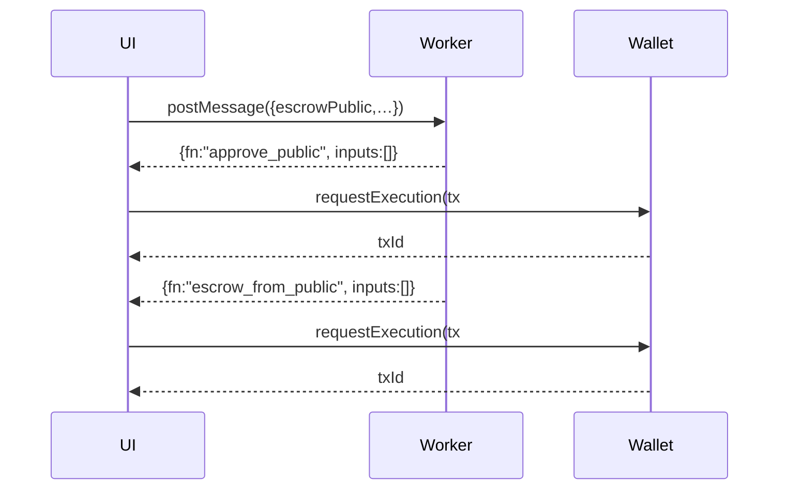

# KinkySwap 🔐💋

_A zero-knowledge private swap matching engine — for the tasteful and anonymous._


## 0. TL;DR

| role       | chain                              | privacy   | main primitive                         |
| ---------- | ---------------------------------- | --------- | -------------------------------------- |
| **Maker**  | Aleo **or** Aztec                  | private   | _“intent” note_ pushed to Redis        |
| **Taker**  | Aleo **or** Aztec                  | private   | locks tokens in a per‑order **escrow** |
| **Escrow** | Aleo today _(Aztec Noir twin WIP)_ | selective | hash‑timelocked vault                  |

A maker only broadcasts `hash(secret)`. The secret itself is revealed **on‑chain** when the taker withdraws, guaranteeing atomicity without a coordinator.

## 1. Overview

**KinkySwap** is a fully-private OTC swap engine where orders are:

- Created off-chain and sealed in encrypted Aleo notes
- Fulfilled on-demand via per-order escrow programs
- Executed privately using the Aleo ZK stack

---

## 2. Features

- 🧠 **Private intents**: Orders are created and sealed in zk notes.
- 🔐 **Per-swap escrows**: On fulfillment, a dedicated Aleo program runs the logic.
- 🌐 **Next.js frontend**: React-based frontend with WebWorker ZK execution.
- 📦 **Redis orderbook**: Store and fetch pending orders for demo/trading.

---

## 3. What you can do right now

1. Connect a Leo/Nightly wallet on **testnet‑beta**
2. Mint a few private \$KNK via `token_registry.aleo/mint_private`
3. Create an **order** (`/create` page) – choose _public_ or _private_ deposit
4. Fulfil someone else’s order: the UI
   1. fetches an unspent private record
   2. asks the worker to build inputs
   3. signs two transitions:
      - `token_registry.aleo/approve_public` _(public path only)_
      - `kinky_swap_escrow_v0.aleo/escrow_from_{public|private}`
5. Withdraw on the destination chain once the secret is revealed (Noir twin in progress).

---

## 4. Swap lifecycle

```
Maker (Aleo)              Taker (Aztec)           KinkySwap Redis
───────────────          ───────────────         ───────────────
1. secret ← rand()
2. push {hash(secret), ...}  ───────────────▶  intent stored
3. — wait —                                       orderbook API
                               4. takes intent ─▶ GET /api/orders
5. escrow_from_public/private() ▶ escrows KNK
                               6. withdraw_to_public/private()
7. secret on‑chain (Aleo)      ◀──────────────    reveals secret
```

`withdraw_block` guards each side (`t2 < t1`) – classic HTLC safety window.

---

---

## 5. Front‑end flow (Next 14)



---

## 6. Aztec Noir twin (roadmap)

- Same struct & hash‑lock
- Uses `aztec.nr` tokens (ERC‑20‑like) and `msg.sender` rollup hints
- Bridge script listens for `FinalizeEscrow` on Aleo → mirrors on Aztec

---

## Tech Stack

- [Aleo](https://aleo.org/) — ZK programming language and VM
- [`@provablehq/sdk`](https://github.com/provable-technology/sdk) — Aleo Web SDK
- [Next.js 14](https://nextjs.org/docs/app) with App Router
- Redis (via Vercel KV)
- TailwindCSS 4

---

## Getting Started

```bash
# Clone the repo
git clone https://github.com/reymom/zkhackberlin-kinkyswap
cd zkhackberlin-kinkyswap

# Install deps
npm install

# Start dev server
npm run dev
```

Create a `.env.local`:

```bash
REDIS_URL=redis://default:<password>@<host>:<port>
```

## License

MIT © zkHack Berlin 2025 team – fork, remix and enjoy 🍸
